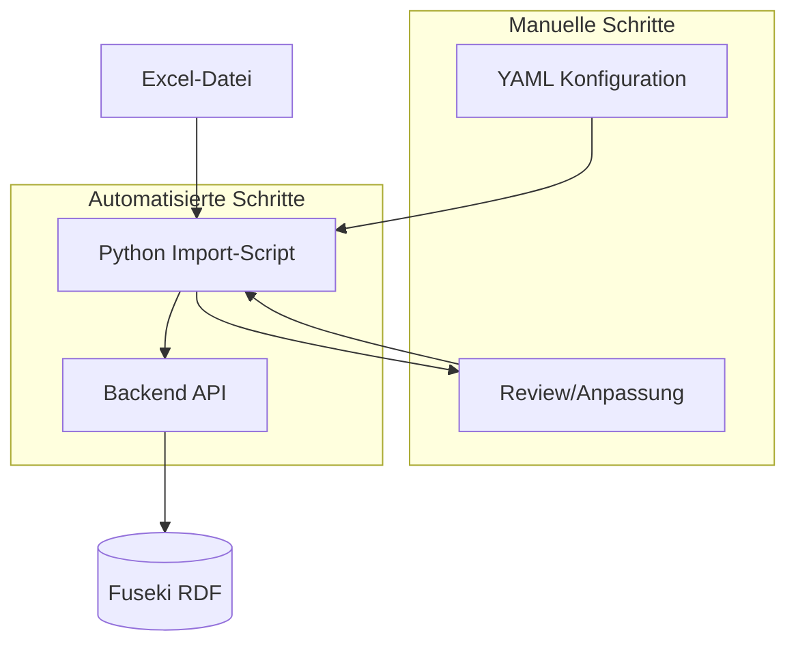

# Plan: Halb-automatisierter Excel-Import für Berechnungsvorschriften

**DONE**

## Ausgangslage

- Die Anwendung akzeptiert Zelleneingaben per UI (`[frontend/index.html](frontend/index.html)`) und erzeugt daraus Berechnungsvorschriften via `POST /api/berechnungsvorschriften`.
- Jede Berechnungsvorschrift entspringt **einer Zelle mit Formel**. Pro Zelle wird eine [Zelleneingabe](backend/models/zelleneingabe.py) benötigt: `tabellenidentifikator`, `tabellenblatt`, `zellenidentifikator`, `beschreibung`, `formel` (sowie optional `kategorie`, `excel_identifikator`).

**Excel-Struktur (laut Anforderung):**

- 31 Tabellenblätter, davon nur eine Auswahl zu laden
- Pro Blatt mehrere Tabellen in festen Bereichen (z.B. Blatt "1. Lohn AW": Tabelle 1 = A5:F16, Tabelle 7 = J25:K29)
- Nicht jede Zelle in den Bereichen ist befüllt; relevant sind primär Zellen mit Formeln

## Architektur-Übersicht




## 1. Konfigurationsdatei (YAML/JSON)

**Zweck:** Einmalig pro Excel-Datei festlegen, welche Blätter und Tabellen verarbeitet werden.

**Struktur (Beispiel):**

```yaml
excel_datei: "Pfad/zur/datei.xlsx"
tabellenblaetter:
  - name: "1. Lohn AW"
    tabellen:
      - id: "Tabelle1"
        bereich: "A5:F16"
        beschreibung_quelle: "zellen"
        beschreibung_aus_zellen:
          erste_spalte_gleiche_zeile: true
          gleiche_spalte_erste_n_zeilen: 2
          trennzeichen: " – "
        wichtige_zellen: ["D7", "E8", "F10"]   # Formelzellen, deren BVs als wichtig geflaggt werden
      - id: "Tabelle7"
        bereich: "J25:K29"
        beschreibung_quelle: "kommentar"
        wichtige_zellen: ["J26", "K27"]   # Zellen, deren BVs als "wichtig" markiert werden (Speicherung + Anzeige)
  - name: "2. Gehalt"
    tabellen:
      - id: "Tabelle1"
        bereich: "B3:E15"
        beschreibung_quelle: "zellen"
        beschreibung_aus_zellen:
          erste_spalte_gleiche_zeile: true
          gleiche_spalte_erste_n_zeilen: 1
          trennzeichen: " – "
```

**Felder:**

- `excel_datei`: Pfad zur Excel-Datei
- `tabellenblaetter`: Liste der zu ladenden Blätter mit Namen
- Pro Blatt: `tabellen[]` mit:
  - `id` (wird zu `tabellenidentifikator`)
  - `bereich` (z.B. A5:F16)
  - `beschreibung_quelle`: Woher die Beschreibung pro Zelle kommt (siehe Abschnitt 2); pro Tabelle konfigurierbar
  - `beschreibung_aus_zellen`: Nur bei `beschreibung_quelle: "zellen"` – definiert pro Tabelle, welche Zeilen/Spalten relativ zum Tabellenbereich die Beschreibung bilden
  - `wichtige_zellen`: Liste von Zellenidentifikatoren (z.B. `["D7", "E8", "F10"]`) – Formelzellen, deren Berechnungsvorschriften als „wichtig“ geflaggt werden. Dieser Flag wird im Hauptcode für Speicherung und Anzeige berücksichtigt.

**Hinweis:** Jede Tabelle kann ein eigenes Beschreibungs-Layout haben (z.B. Tabelle1: 2 Headerzeilen + erste Spalte; Tabelle7: nur Kommentare). Pro Tabellenblatt lassen sich damit mehrere wichtige Berechnungsvorschriften konfigurieren.

**Speicherort:** z.B. `backend/config/excel_import_config.yaml` oder projektbezogen im Projektroot

---

## 2. Ermittlung der Beschreibung pro Zelle


| Option        | Erläuterung                                                                                    | Manueller Aufwand                        |
| ------------- | ---------------------------------------------------------------------------------------------- | ---------------------------------------- |
| **zellen**    | Beschreibung aus konfigurierten Zeilen/Spalten (siehe `beschreibung_aus_zellen` – pro Tabelle) | Niedrig, wenn Layout bekannt             |
| **kommentar** | Excel-Zellkommentar als `beschreibung`                                                         | Niedrig, sofern Kommentare gepflegt sind |
| **links**     | Wert aus Zelle links neben der Formelzelle (Konvention: Beschreibung in vorheriger Spalte)     | Mittel, Layout muss Konvention erfüllen  |
| **oben**      | Wert aus Zelle darüber (z.B. Zeilenüberschrift)                                                | Mittel, analog                           |
| **formel**    | Fallback: nur Formel, LLM kann aus Kontext ableiten (weniger präzise)                          | Niedrig                                  |
| **manuell**   | Beschreibungen in separater CSV/Excel hinterlegen und per Script zuordnen                      | Hoch, maximal kontrollierbar             |


### Option `zellen` – Zeilen und Spalten konfigurieren (pro Tabelle)

Bei `beschreibung_quelle: "zellen"` werden Zeilen und Spalten **relativ zum Tabellenbereich** angegeben – jede Tabelle kann eine eigene `beschreibung_aus_zellen`-Konfiguration haben. Die Beschreibung setzt sich aus den Werten der angegebenen Zellen zusammen.

**Beispiel:** Tabelle A5:F16, Formelzelle B7. Konfiguration:

- `erste_spalte_gleiche_zeile: true` → A7 (erste Spalte, gleiche Zeile wie B7)
- `gleiche_spalte_erste_n_zeilen: 2` → B5, B6 (gleiche Spalte wie B7, erste 2 Zeilen der Tabelle)

**Ergebnis:** Beschreibung = Werte aus B5, B6, A7 – verknüpft mit `trennzeichen` (z.B. `"B5 – B6 – A7"` oder `"Bruttolohn – Nettolohn – Facharbeiter"`).

**Config-Felder:**

- `erste_spalte_gleiche_zeile`: Wenn `true`, wird der Wert aus der ersten Spalte derselben Zeile verwendet (z.B. Zeilenbeschriftung).
- `gleiche_spalte_erste_n_zeilen`: Anzahl der obersten Zeilen; deren Werte in der gleichen Spalte wie die Formelzelle werden einbezogen (z.B. Spaltenüberschriften).
- `trennzeichen`: String zum Verknüpfen der Einzelwerte (Default: `" – "`).

Die Reihenfolge der Verknüpfung im Script: zuerst die Zeilen-Werte (von oben nach unten), dann der Spalten-Wert – oder konfigurierbar.

**Empfehlung:** `beschreibung_quelle: "zellen"` wenn das Excel-Layout bekannt ist (erste Spalte = Zeilenbeschriftung, erste n Zeilen = Spaltenüberschriften); sonst `"kommentar"`; Fallback `"formel"` mit Hinweis auf spätere manuelle Ergänzung im UI.

---

## 3. Python Import-Script

**Technologie:** `openpyxl` (in `[backend/requirements.txt](backend/requirements.txt)` ergänzen) für das Lesen von Formeln, Zellwerten und Kommentaren.

**Ablauf des Scripts:**

1. Konfiguration laden (YAML)
2. Excel-Datei öffnen
3. Pro konfiguriertem Blatt und Tabellenbereich:
  - Bereich iterieren
  - Nur Zellen mit Formel (`cell.value` mit führendem `=`) berücksichtigen
  - Pro Formelzelle: `Zelleneingabe` bauen:
    - `tabellenidentifikator` ← aus Config (Pro-Tabelle)
    - `tabellenblatt` ← Blattname aus Config
    - `zellenidentifikator` ← z.B. "D7"
    - `beschreibung` ← gemäß `beschreibung_quelle` der jeweiligen Tabelle (bei `zellen`: aus tabellenspezifischem `beschreibung_aus_zellen`)
    - `formel` ← rohe Formel (z.B. `=A1+B1`)
    - `wichtig` ← `true`, falls `zellenidentifikator` in `wichtige_zellen` der Tabelle steht, sonst `false`
    - optional: `excel_identifikator` aus benannten Bereichen / definierten Namen, falls vorhanden
4. **Dry-Run:** Ausgabe als JSON/CSV zur manuellen Prüfung
5. **Import:** HTTP-POST an `POST /api/berechnungsvorschriften` pro Zelleneingabe (oder Batch-Endpoint, falls ergänzt)

**Skript-Orte:** z.B. `backend/scripts/excel_import.py` als CLI-Script mit Argumenten für Config-Pfad, Excel-Pfad, Dry-Run/Import-Modus. Beim Import: Ist die Formelzelle in `wichtige_zellen` der Tabelle, setzt das Script `wichtig: true` in der Zelleneingabe bzw. im API-Request.

---

## 3a. Anpassungen im Hauptcode (Flag „wichtig“)

Damit der Flag aus der Config persistiert und im UI sichtbar ist, müssen folgende Stellen angepasst werden:

### Datenmodell

- `**[backend/models/berechnungsvorschrift.py](backend/models/berechnungsvorschrift.py)`:** Neues optionales Feld  
`wichtig: Optional[bool] = Field(False, description="Markierung: wichtige Berechnungsvorschrift")`
- `**[backend/models/zelleneingabe.py](backend/models/zelleneingabe.py)`:** Neues optionales Feld  
`wichtig: Optional[bool] = Field(None, description="Wenn true, wird die erstellte BV als wichtig gespeichert")`

### Persistenz (RDF)

- `**[backend/services/json_rdf_converter.py](backend/services/json_rdf_converter.py)`:**
  - `berechnungsvorschrift_to_rdf`: Bei `wichtig=True` Triple `bv_uri bv:hatWichtig "true"` hinzufügen
  - `rdf_to_berechnungsvorschrift`: `hatWichtig` auslesen, `wichtig` im Berechnungsvorschrift-Objekt setzen (Default: `False`)

### API

- `**[backend/api/routes/berechnungsvorschriften.py](backend/api/routes/berechnungsvorschriften.py)`:**  
Nach Erzeugung der BV durch das LLM: `berechnungsvorschrift.wichtig = zelleneingabe.wichtig` setzen, wenn `zelleneingabe.wichtig` gesetzt ist. Beim PUT (Update) soll `wichtig` bearbeitbar sein (bereits im Request-Body enthalten).
- **Optional – Suche:** `[rdf_service.py](backend/services/rdf_service.py)` und Route `GET /suche`: Query-Parameter `wichtig` (z.B. `?wichtig=true`) für Filter „nur wichtige BVs“.

### Frontend (Anzeige)

- **Berechnungsvorschriften-Liste** (`[frontend/berechnungsvorschriften.html](frontend/berechnungsvorschriften.html)`, `[frontend/zellen-uebersicht.html](frontend/zellen-uebersicht.html)`): Wichtige BVs mit Badge/Icon kennzeichnen (z.B. „Wichtig“-Badge)
- **Detailansicht** (`[frontend/berechnungsvorschrift.html](frontend/berechnungsvorschrift.html)`): `wichtig` anzeigen und im Editor änderbar
- **Neue Berechnungsvorschrift** (`[frontend/index.html](frontend/index.html)`): Optionales Checkbox-Feld „Wichtig“ im Zelleneingabe-Formular
- **Suche/Filter:** Optionaler Filter „nur wichtige BVs“ (z.B. GET-Parameter `wichtig=true` oder Filter-UI)

### Import-Script

- `**backend/scripts/excel_import.py`:** Pro Formelzelle prüfen, ob `zellenidentifikator` in `wichtige_zellen` der Tabelle enthalten ist; falls ja, `wichtig: true` in der Zelleneingabe/API-Request setzen.

---

## 4. Manuelle Schritte (minimal)

1. **Konfiguration anlegen:** YAML-Datei mit Blattauswahl und Tabellenbereichen erstellen (einmalig pro Excel)
2. **Beschreibungen prüfen:** Bei `beschreibung_quelle: "formel"` oder fehlenden Kommentaren ggf. Beschreibungen in Excel ergänzen oder nachträglich im UI korrigieren
3. **Dry-Run prüfen:** Vor dem Import die vom Script erzeugte Liste (JSON/CSV) gegen das Excel prüfen
4. **Import ausführen:** Script mit `--import` starten
5. **Nachbearbeitung:** Mehrfach-Treffer bei Variablen im UI auflösen (bereits unterstützt); fehlende Verlinkungen ggf. manuell setzen

---

## 5. Erweiterungen (optional)

- **Batch-API:** `POST /api/berechnungsvorschriften/batch` mit Array von Zelleneingaben für schnelleren Import
- **UI-Upload:** Excel-Upload im Frontend + Blatt-/Tabellenauswahl + Vorschau vor Import
- **Excel-Identifikator:** Auslesen von benannten Bereichen (openpyxl `defined_names`) für Zellen, die Namen zugewiesen haben
- **Referenz-Blätter:** Bei Formeln mit Blatt-Referenz (z.B. `='1. Lohn AW'!G19`) `tabellenblatt_referenz` in Variablen setzen – Matcher berücksichtigt dies bereits

---

## 6. Dateistruktur (Vorschlag)

```
backend/
├── config/
│   └── excel_import_config.yaml   # Projekt-/Datei-spezifische Konfiguration
├── scripts/
│   └── excel_import.py            # Import-Script
└── requirements.txt               # + openpyxl, pyyaml
```

---

## 7. Implementierungs-Reihenfolge

1. **Flag „wichtig“ im Hauptcode** (Voraussetzung für Import):
  - `Berechnungsvorschrift`- und `Zelleneingabe`-Modelle erweitern
  - JSON-RDF-Konverter (Schreiben/Lesen von `hatWichtig`)
  - API: `wichtig` aus Zelleneingabe in BV übernehmen, bei PUT berücksichtigen
  - Frontend: Anzeige (Badge), Editor-Feld, optional Filter
2. `openpyxl` und `pyyaml` in `requirements.txt` ergänzen
3. YAML-Config-Schema und Beispiel-Config erstellen
4. `excel_import.py` implementieren:
  - Config laden
  - Excel parsen (nur Formelzellen in konfigurierten Bereichen)
  - Zelleneingaben erzeugen inkl. Beschreibungslogik (pro Tabelle) und `wichtig`-Flag aus `wichtige_zellen`:
    - bei `beschreibung_quelle: "zellen"`: relative Zeilen/Spalten aus tabellenspezifischem `beschreibung_aus_zellen` auswerten
  - Dry-Run (JSON/CSV-Export)
  - Import-Modus (API-Aufrufe)
5. Plan-Dokumentation in diesem Projekt persistieren (z.B. `EXCEL_IMPORT_PLAN.md`)
6. Optional: Batch-Endpoint und UI-Erweiterung

---

## Kurzfassung der manuellen Schritte


| Schritt                                                   | Aufwand             | Häufigkeit      |
| --------------------------------------------------------- | ------------------- | --------------- |
| Config mit Blatt-, Tabellenbereichen und wichtigen Zellen | 30–60 min           | Pro Excel-Datei |
| Beschreibungen in Excel/Config pflegen (falls nötig)      | variabel            | Pro Excel-Datei |
| Dry-Run-Output prüfen                                     | 5–15 min            | Pro Import-Lauf |
| Import starten                                            | 1 min               | Pro Import-Lauf |
| Mehrfach-Treffer im UI auflösen                           | 2–5 min pro Treffer | Nach Import     |


