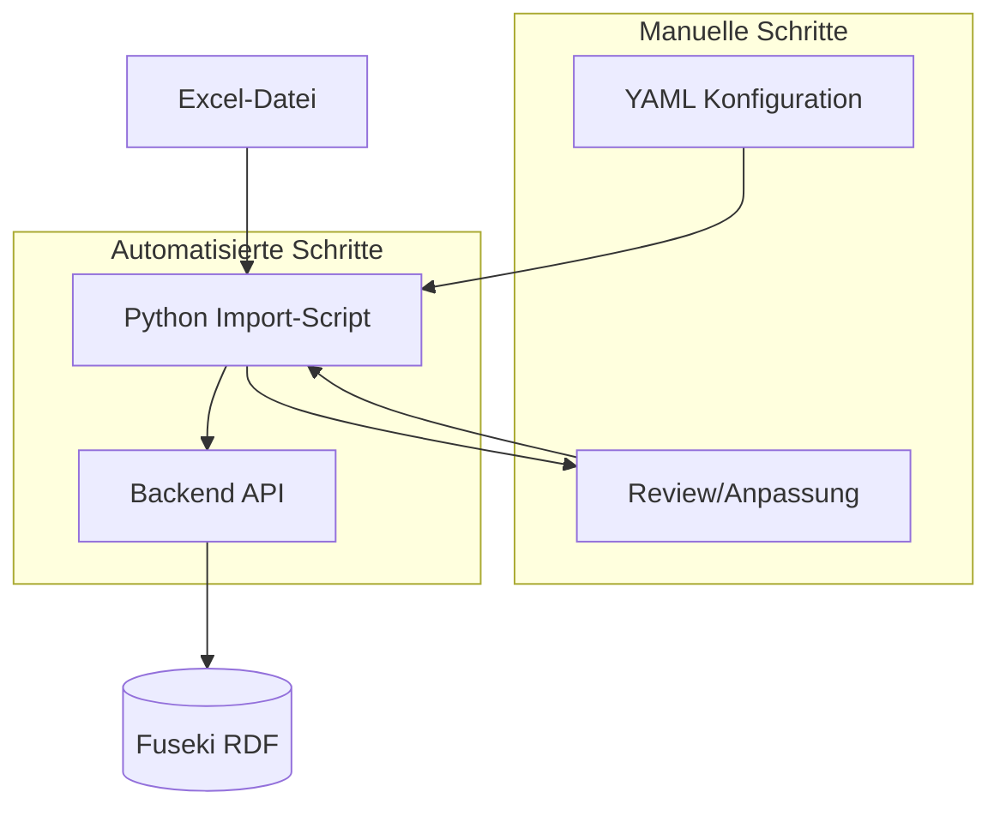

# Plan: Halb-automatisierter Excel-Import für Berechnungsvorschriften

## Ausgangslage

- Die Anwendung akzeptiert Zelleneingaben per UI ([frontend/index.html](frontend/index.html)) und erzeugt daraus Berechnungsvorschriften via `POST /api/berechnungsvorschriften`.
- Jede Berechnungsvorschrift entspringt **einer Zelle mit Formel**. Pro Zelle wird eine [Zelleneingabe](backend/models/zelleneingabe.py) benötigt: `tabellenidentifikator`, `tabellenblatt`, `zellenidentifikator`, `beschreibung`, `formel` (sowie optional `kategorie`, `excel_identifikator`).

**Excel-Struktur (laut Anforderung):**

- 31 Tabellenblätter, davon nur eine Auswahl zu laden
- Pro Blatt mehrere Tabellen in festen Bereichen (z.B. Blatt "1. Lohn AW": Tabelle 1 = A5:F16, Tabelle 7 = J25:K29)
- Nicht jede Zelle in den Bereichen ist befüllt; relevant sind primär Zellen mit Formeln

## Architektur-Übersicht



## 1. Konfigurationsdatei (YAML/JSON)

**Zweck:** Einmalig pro Excel-Datei festlegen, welche Blätter und Tabellen verarbeitet werden.

**Struktur (Beispiel):**

```yaml
excel_datei: "Pfad/zur/datei.xlsx"
tabellenblaetter:
  - name: "1. Lohn AW"
    tabellen:
      - id: "Tabelle1"
        bereich: "A5:F16"
        beschreibung_quelle: "zellen"
        beschreibung_aus_zellen:
          erste_spalte_gleiche_zeile: true
          gleiche_spalte_erste_n_zeilen: 2
          trennzeichen: " – "
        wichtige_zellen: ["D7", "E8", "F10"]
      - id: "Tabelle7"
        bereich: "J25:K29"
        beschreibung_quelle: "kommentar"
        wichtige_zellen: ["J26", "K27"]
  - name: "2. Gehalt"
    tabellen:
      - id: "Tabelle1"
        bereich: "B3:E15"
        beschreibung_quelle: "zellen"
        beschreibung_aus_zellen:
          erste_spalte_gleiche_zeile: true
          gleiche_spalte_erste_n_zeilen: 1
          trennzeichen: " – "
```

**Felder:**

- `excel_datei`: Pfad zur Excel-Datei
- `formel_ersetzung` (optional): Mapping Formel → Text. Wenn eine Beschreibung eine Formel enthält (z.B. weil Referenzzellen Formeln haben), wird sie durch den Text ersetzt. Beispiel: `"=$'INTERN BEZÜGE'.$D$3": "Vollzeit festangestellt"`
- `tabellenblaetter`: Liste der zu ladenden Blätter mit Namen
- Pro Blatt: `tabellen[]` mit:
  - `id` (wird zu `tabellenidentifikator`)
  - `bereich` (z.B. A5:F16)
  - `beschreibung_quelle`: Woher die Beschreibung pro Zelle kommt (siehe Abschnitt 2); pro Tabelle konfigurierbar
  - `beschreibung_aus_zellen`: Nur bei `beschreibung_quelle: "zellen"` – definiert pro Tabelle, welche Zeilen/Spalten relativ zum Tabellenbereich die Beschreibung bilden
  - `wichtige_zellen`: Liste von Zellenidentifikatoren (z.B. `["D7", "E8", "F10"]`) – Formelzellen, deren Berechnungsvorschriften als „wichtig“ geflaggt werden.
  - `formel_spalten` (optional): Liste von Spaltenbuchstaben (z.B. `["G"]` oder `["G", "H"]`). Wenn gesetzt, werden nur Zellen in diesen Spalten als Formelzellen importiert; die übrigen Spalten im Bereich dienen nur zur Beschreibungsermittlung (z.B. A21/A22 für erste_spalte_gleiche_zeile). Ohne Angabe: alle Spalten im Bereich.

**Speicherort:** `backend/config/excel_import_config.yaml`

## 2. Ermittlung der Beschreibung pro Zelle

| Option        | Erläuterung                                                                                    |
| ------------- | ---------------------------------------------------------------------------------------------- |
| **zellen**    | Beschreibung aus konfigurierten Zeilen/Spalten (siehe `beschreibung_aus_zellen` – pro Tabelle) |
| **kommentar** | Excel-Zellkommentar als `beschreibung`                                                         |
| **links**     | Wert aus Zelle links neben der Formelzelle                                                     |
| **oben**      | Wert aus Zelle darüber (z.B. Zeilenüberschrift)                                                |
| **formel**    | Fallback: nur Formel, LLM kann aus Kontext ableiten                                            |
| **manuell**   | Beschreibungen in separater CSV/Excel hinterlegen                                               |

### Zusammengeführte Zellen (Merge)

Bei zusammengeführten Zellen speichert Excel den Wert nur in der oberen linken Zelle. Die übrigen Zellen sind leer. Das Import-Script nutzt `zellenwert_mit_merge`: Beim Lesen von Beschreibungen wird bei MergedCells der Wert der Top-Left-Zelle verwendet (z.B. A7:A18 → Wert aus A7 für alle Zeilen 7–18).

### Option `zellen` – Zeilen und Spalten konfigurieren (pro Tabelle)

Bei `beschreibung_quelle: "zellen"`:
- `erste_spalte_gleiche_zeile`: Wert aus erster Spalte, gleiche Zeile wie Formelzelle
- `gleiche_spalte_erste_n_zeilen`: Werte aus gleicher Spalte, erste n Zeilen der Tabelle
- `trennzeichen`: String zum Verknüpfen (Default: `" – "`)

## 3. Python Import-Script

**Datei:** `backend/scripts/excel_import.py`

**Verwendung:**
```bash
# Dry-Run (Vorschau):
python scripts/excel_import.py -c config/excel_import_config.yaml -e datei.xlsx

# Import per API:
python scripts/excel_import.py -c config/excel_import_config.yaml -e datei.xlsx --import

# Mit Docker (bei laufendem Stack):
docker compose exec middleware python scripts/excel_import.py -c config/excel_import_config.yaml -e /pfad/zur/datei.xlsx --import
```

**Ablauf:**
1. Konfiguration laden (YAML)
2. Excel-Datei öffnen (openpyxl)
3. Pro Tabellenbereich: Formelzellen erkennen, Zelleneingaben mit Beschreibung und `wichtig`-Flag erzeugen
4. Dry-Run: JSON/CSV ausgeben
5. Import: HTTP-POST an `/api/berechnungsvorschriften` pro Zelleneingabe

## 4. Manuelle Schritte (minimal)

1. **Konfiguration anlegen:** YAML-Datei mit Blattauswahl, Tabellenbereichen und wichtigen Zellen
2. **Beschreibungen prüfen:** Ggf. in Excel ergänzen oder im UI korrigieren
3. **Dry-Run prüfen:** JSON/CSV gegen Excel vergleichen
4. **Import ausführen:** `--import` starten
5. **Nachbearbeitung:** Mehrfach-Treffer im UI auflösen

## 5. Dateistruktur

```
backend/
├── config/
│   └── excel_import_config.yaml   # Beispiel-Config
├── scripts/
│   └── excel_import.py            # Import-Script
└── requirements.txt               # inkl. openpyxl, PyYAML
```

## Kurzfassung der manuellen Schritte

| Schritt                                                   | Aufwand             |
| --------------------------------------------------------- | ------------------- |
| Config mit Blatt-, Tabellenbereichen und wichtigen Zellen | 30–60 min           |
| Beschreibungen in Excel/Config pflegen (falls nötig)      | variabel            |
| Dry-Run-Output prüfen                                     | 5–15 min            |
| Import starten                                            | 1 min               |
| Mehrfach-Treffer im UI auflösen                           | 2–5 min pro Treffer |
