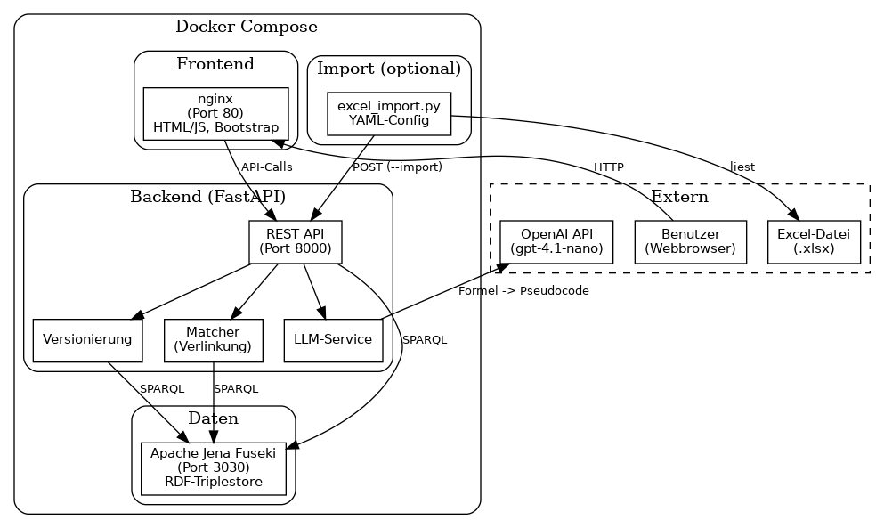
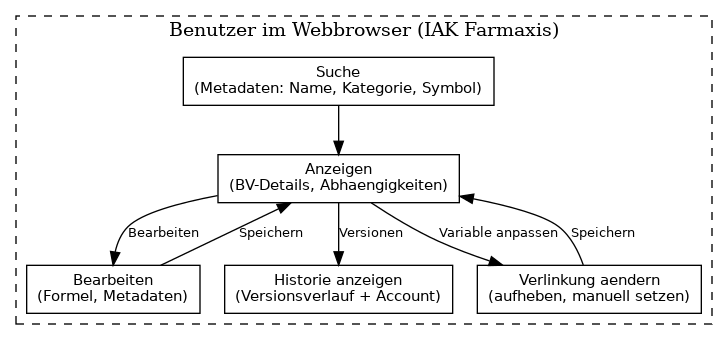

# Excel zu Berechnungsvorschriften

Ein Python-Web-Projekt zur automatischen Generierung von menschenlesbaren Berechnungsvorschriften aus Excel-Formeln mittels LLM (OpenAI).

## Überblick

Die Anwendung wandelt Excel-Formeln in strukturierte Berechnungsvorschriften um: Der LLM-Service erzeugt aus Zellendaten (Tabellenblatt, Zelle, Formel, Beschreibung) einen menschenlesbaren Pseudocode. Variablen werden automatisch mit bestehenden Berechnungsvorschriften verlinkt. Daten werden in einem RDF-Triplestore (Apache Jena Fuseki) gespeichert.

## Architektur



## Wartung (Benutzer-Workflow)



Der Workflow zeigt die Benutzeraktionen im Webbrowser: Suche über Metadaten, Anzeige von BV-Details und Abhängigkeiten, Bearbeiten von Formel und Metadaten, Anpassen von Verlinkungen sowie Anzeige der Versionshistorie.

## Kernfunktionen

- **LLM-Generierung**: Excel-Formeln → menschenlesbarer Pseudocode (Name, Formel, Variablen, Metadaten)
- **Automatische Verlinkung**: Variablen werden per Matcher mit BVs verknüpft (Zellenidentifikator, Tabellenblatt, ggf. Excel-Identifikator)
- **Cross-Sheet-Referenzen**: `tabellenblatt_referenz` für Zellen aus anderen Blättern
- **Versionierung**: Jede Änderung erzeugt eine neue Version
- **Abhängigkeiten**: Anzeige von „verwendet“ und „verwendet in“; Zirkularitätsprüfung
- **Suche**: Filter nach Metadaten (Name, Kategorie, Symbol, Datentyp, Einheit, wichtig)
- **Excel-Import**: Halb-automatisierter Import per Script mit YAML-Config

## Voraussetzungen

- Docker und Docker Compose
- OpenAI API Key

## Installation

```bash
cp .env.example .env
# .env bearbeiten: OPENAI_API_KEY eintragen

docker compose up -d
```

## Verwendung

| URL | Beschreibung |
|-----|--------------|
| http://localhost | Neue Berechnungsvorschrift erstellen |
| http://localhost/berechnungsvorschriften.html | Alle Berechnungsvorschriften |
| http://localhost/zellen-uebersicht.html | Zellen gruppiert nach Tabelle/Blatt |
| http://localhost:8000/docs | API (Swagger) |
| http://localhost:8000/redoc | API (ReDoc) |

**Excel-Import** (im Backend-Container oder lokal mit Python):

```bash
# Dry-Run (Vorschau):
python scripts/excel_import.py --config config/excel_import_config.yaml --excel datei.xlsx

# Import (API-Aufrufe):
python scripts/excel_import.py --config config/excel_import_config.yaml --excel datei.xlsx --import
```

Config: `backend/config/excel_import_config.yaml` (Tabellenidentifikatoren, Tabellenblätter, Bereiche, `formel_spalten`, `wichtige_zellen`, `beschreibung_quelle`).

## Projektstruktur

```
├── docker-compose.yml       # Frontend (nginx), Middleware (FastAPI), Fuseki
├── backend/
│   ├── main.py             # FastAPI App
│   ├── config/             # YAML (z.B. excel_import_config.yaml)
│   ├── models/             # Pydantic (Berechnungsvorschrift, Zelleneingabe)
│   ├── services/           # LLM, RDF, Matcher, Versionierung
│   ├── api/routes/         # REST-Endpunkte
│   ├── prompts/            # LLM-Prompt und Beispiel
│   └── scripts/            # excel_import.py, set_formel_original.py
└── frontend/               # HTML/JS (Bootstrap 5)
```

## Technologie-Stack

- **Backend**: FastAPI (Python)
- **Frontend**: Vanilla HTML/JS, Bootstrap 5
- **Datenbank**: Apache Jena Fuseki (RDF)
- **LLM**: OpenAI (gpt-4.1-nano)
- **Container**: Docker Compose

## Entwicklung

```bash
docker compose up
```

- Frontend: http://localhost
- Backend API: http://localhost:8000
- Fuseki: http://localhost:3030

## Hinweise

- `OPENAI_API_KEY` in `.env` setzen
- Fuseki kann beim ersten Start etwas Zeit zum Initialisieren benötigen
- Logging: INFO (Standard), DEBUG für Details (LLM, SPARQL, Matcher)
