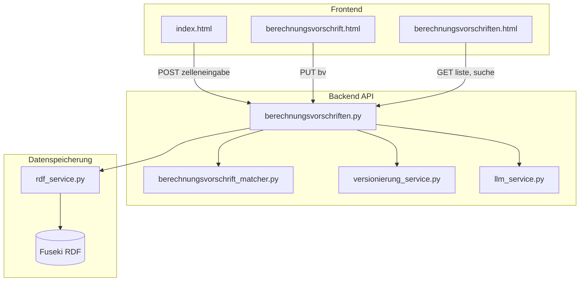

# Code-Verbesserungen aus Dokumentationsanalyse

## Ausgangslage

Die Dokumentation unter [dokumentation/](dokumentation/) beschreibt fachlich und konzeptionell, wie Berechnungsvorschriften versioniert und gewartet werden. Die aktuelle Implementierung in ExcelToBerechnungsvorschriften deckt viele Aspekte ab, weist aber Lücken und Verbesserungspotenziale auf.

---

## 1. UI-Verbesserungen

### 1.1 Formel-Validierung beim Bearbeiten (hohe Priorität)

**Dokumentation:** [04_formel_wartbarkeit.md](dokumentation/04_formel_wartbarkeit.md) – „Variablen im Formel-String müssen in der Variablen-Liste existieren – Fehlermeldung bei Abweichung.“

**Ist-Zustand:** Im Bearbeiten-Modal ([berechnungsvorschrift.html](frontend/berechnungsvorschrift.html) Zeile 192–194) wird die Formel als Freitext bearbeitet. Es gibt **keine Validierung**, ob die Variablennamen im Formel-String mit `variablen[]` übereinstimmen.

**Vorschlag:** 

- Beim Speichern (oder onBlur) prüfen: Alle Variablennamen im Formel-String (via Regex oder Parser) müssen in `variablen[]` vorkommen.
- Fehlermeldung anzeigen: „Variable ‚XYZ‘ kommt in der Formel vor, ist aber nicht in der Variablen-Liste definiert.“
- Optional: Warnung bei Variablen in der Liste, die nicht in der Formel vorkommen (könnte Absicht sein).

**Nebeneffekte und weitere Änderungen:**

- **Abhängigkeit von Backend-Validierung (2.2):** Die UI-Validierung sollte dieselbe Logik nutzen wie das Backend – sonst kann das Backend ablehnen, obwohl die UI grünes Licht gab. Empfehlung: Backend-Validierung zuerst, dann UI nutzt gleiche Regeln (oder ruft Validierungs-API auf).
- **Pseudocode-Parsing:** Die Doku erlaubt: Variablen, Operatoren (+ - * /), Klammern, „Wenn Bedingung dann Wert1 sonst Wert2“, Vergleiche. Reservierte Wörter: „Wenn“, „dann“, „sonst“. Variablenkandidaten = alle Wörter (Regex `\b[\wäöüÄÖÜß]+\b`) minus Reservierte minus Zahlen. [formel_utils.py](backend/utils/formel_utils.py) hat nur `excel_identifikatoren_aus_formel` – für Pseudocode braucht es neue Funktion.
- **Variablen-Liste nicht editierbar:** Im Bearbeiten-Modal können Variablen nicht hinzugefügt/entfernt werden. Wenn der User eine neue Variable in die Formel schreibt, schlägt die Validierung zu Recht fehl. Das ist gewollt – neue Variablen erfordern ggf. Regenerierung oder separaten Workflow.

---

### 1.2 Metadaten-Hover für Variablen (mittlere Priorität)

**Dokumentation:** [04_formel_wartbarkeit.md](dokumentation/04_formel_wartbarkeit.md) – „Beim Hover oder in einer Sidebar: Kategorie, Symbol, Einheit der Variablen und der aktuellen BV.“

**Ist-Zustand:** Variablen sind anklickbar ([berechnungsvorschriften.js](frontend/js/berechnungsvorschriften.js) `formatiereFormelMitVariablen`). Metadaten der **aktuellen** BV werden angezeigt. Metadaten der **Variablen** (der referenzierten BVs) werden nicht beim Hover gezeigt.

**Vorschlag:** 

- Beim Hover über eine Variable (Badge/Link) ein Tooltip anzeigen: Kategorie, Symbol, Einheit der referenzierten BV.
- Dafür müssen die referenzierten BVs geladen werden (oder Metadaten in der Variablen-Liste mitführen – aktuell nur `referenz_berechnungsvorschrift_id`).

**Nebeneffekte und weitere Änderungen:**

- **Daten bereits vorhanden auf Detailseite:** [berechnungsvorschrift.html](frontend/berechnungsvorschrift.html) lädt `verwendet` (referenzierte BVs) – Metadaten sind also da. Nur `formatiereFormelMitVariablen` in [berechnungsvorschriften.js](frontend/js/berechnungsvorschriften.js) muss erweitert werden: optionaler Parameter `refBvsMap` (ref_id → {kategorie, symbol, einheit}), dann `title="..."` auf Links setzen.
- **Nur auf Detailseite, nicht in Liste:** Auf [berechnungsvorschriften.html](frontend/berechnungsvorschriften.html) werden BVs ohne „verwendet“ geladen – N+1 vermeiden. Hover-Metadaten nur auf Detailseite sinnvoll.

---

### 1.3 Abhängigkeitsgraph visualisieren (niedrige Priorität)

**Dokumentation:** [01_definition.md](dokumentation/01_definition.md) – Abhängigkeitsgraph als DAG.

**Ist-Zustand:** Listen „Verwendet“ und „Wird verwendet in“ sind vorhanden. Keine **graphische** Darstellung des Abhängigkeitsgraphen.

**Vorschlag:** 

- Optional: Seite oder Modal mit DAG-Visualisierung (z.B. D3.js, vis.js oder gerenderte DOT-Grafik).
- Für große Mengen: nur für ausgewählte BV und ihre direkten/indirekten Abhängigkeiten.

**Bewertung:** **Nice-to-have**. Aufwand: hoch. Kann für IAK Farmaxis relevant sein.

---

### 1.4 Mehrere Treffer: Auswahl-Oberfläche (bereits implementiert – entfernt)

**Ist-Zustand:** [index.html](frontend/index.html) Zeile 225–234 zeigt `mehrere_treffer` bereits an – mit Links zu `verlinkeVariable()`. Die Auswahl-Oberfläche ist vorhanden.

**Bewertung:** **Entfernt** – keine Änderung nötig. Optional: Hinweis prominenter machen oder Modal erzwingen, bevor User zur Detailseite geht – Aufwand minimal, Nutzen gering.

---

### 1.5 Formel-Editor: Variablen als Chips einfügbar (niedrige Priorität)

**Dokumentation:** [04_formel_wartbarkeit.md](dokumentation/04_formel_wartbarkeit.md) – „Strukturierter Editor: Variablen als Chips/Badges einfügbar“.

**Ist-Zustand:** Nur Freitext-Textarea.

**Vorschlag:** 

- Dropdown oder Button-Liste „Variable einfügen“ – Klick fügt Variablenname an Cursor-Position ein.
- Reduziert Tippfehler bei Variablennamen.

**Nebeneffekte:** Variablen sind beim Bearbeiten nicht editierbar – „Variable einfügen“ kann nur existierende Variablen einfügen. Das ist korrekt (vermeidet Tippfehler). Kein Widerspruch.

---

## 2. Backend-Verbesserungen

### 2.1 Account-Referenz (erstellt_von, geaendert_von) (hohe Priorität)

**Dokumentation:** [02_versionierungskonzept.md](dokumentation/02_versionierungskonzept.md) – „Jede Version sollte `erstellt_von` und `geaendert_von` enthalten.“

**Ist-Zustand:** 

- [berechnungsvorschrift.py](backend/models/berechnungsvorschrift.py): Nur `erstellt_am`, `geaendert_am` – **keine** `erstellt_von`, `geaendert_von`.
- [json_rdf_converter.py](backend/services/json_rdf_converter.py): Keine RDF-Properties für Account.
- [versionierung_service.py](backend/services/versionierung_service.py): Keine Account-Übernahme.

**Vorschlag:** 

- Model erweitern: `erstellt_von: Optional[str]`, `geaendert_von: Optional[str]` (Account-ID oder Benutzername).
- API: Bei POST/PUT den aktuellen Benutzer aus Auth-Header oder Session übernehmen (falls Auth vorhanden).
- RDF: `hatErstelltVon`, `hatGeaendertVon` als Literale.
- Ohne Auth: Optionaler Query-Parameter `geaendert_von` für manuelle Angabe (Fallback).

**Nebeneffekte und weitere Änderungen:**

- **Kein Auth-System:** ExcelToBerechnungsvorschriften hat keine Benutzer-Authentifizierung. Ohne Auth ist `erstellt_von`/`geaendert_von` nur mit manueller Eingabe möglich – z.B. optionales Feld im Frontend (Cookie/localStorage) oder Header `X-User-Name`. Ohne das bleibt das Feld null.
- **Alle Stellen anpassen:** [llm_service.py](backend/services/llm_service.py) setzt `erstellt_am`/`geaendert_am` (Zeile 190–191) – hier müsste `erstellt_von` aus Request-Kontext kommen. [versionierung_service.py](backend/services/versionierung_service.py): `geaendert_von` übernehmen oder setzen. API-Routes: verlinkung_aufheben, verlinke_variable_manuell setzen `geaendert_am` – auch `geaendert_von`.
- **RDF-Converter:** [json_rdf_converter.py](backend/services/json_rdf_converter.py) – `berechnungsvorschrift_to_rdf` und `rdf_to_berechnungsvorschrift` um hatErstelltVon/hatGeaendertVon erweitern.
- **Excel-Import:** [excel_import.py](backend/scripts/excel_import.py) ruft die API auf – müsste ggf. User-Header mitschicken.
- **Bewertung:** Ohne Auth nur optional; für IAK Farmaxis mit Auth erforderlich. Kein Widerspruch – Feld kann null bleiben.

---

### 2.2 Formel-Validierung im Backend (hohe Priorität)

**Dokumentation:** [01_definition.md](dokumentation/01_definition.md) – „Jeder Variablenname im Formel-String muss exakt einer Variable in `variablen[]` entsprechen.“

**Ist-Zustand:** Keine Validierung bei PUT oder POST (Regenerierung).

**Vorschlag:** 

- Utility-Funktion `validiere_formel_variablen(formel: str, variablen: List[Variable]) -> List[str]` (Liste der Fehler).
- Variablen im Formel-String extrahieren (Regex für erlaubte Operatoren und Variablennamen – vgl. [formel_utils.py](backend/utils/formel_utils.py)).
- Bei PUT: Validierung vor Speichern; bei Fehlern HTTP 400 mit Fehlerliste.

**Nebeneffekte und weitere Änderungen:**

- **Gemeinsame Utility:** Neue Funktion in [formel_utils.py](backend/utils/formel_utils.py): `extrahiere_variablen_aus_pseudocode(formel: str) -> List[str]` und `validiere_formel_variablen(formel, variablen) -> List[str]`. Muss Pseudocode-Syntax kennen (reservierte Wörter: Wenn, dann, sonst; Operatoren; Zahlen).
- **Alle Stellen mit Formel:** PUT [berechnungsvorschriften.py](backend/api/routes/berechnungsvorschriften.py), POST regenerieren (Zeile 303–336). Bei POST erstellen: Die BV kommt vom LLM – Validierung könnte LLM-Fehler abfangen. Empfehlung: Validierung bei PUT und POST regenerieren; bei POST erstellen optional (LLM könnte konsistent sein).
- **Response-Format:** Bei HTTP 400: `{"detail": "..."}` oder `{"detail": ["Variable X nicht in variablen[]", "Variable Y nicht in variablen[]"]}` – Fehlerliste für UI.

---

### 2.3 Zirkularitätsprüfung bei manueller Verlinkung (bereits implementiert)

**Ist-Zustand:** [berechnungsvorschriften.py](backend/api/routes/berechnungsvorschriften.py) Zeile 371–377 – Zirkularitätsprüfung bei `verlinke_variable_manuell`. ✓

---

### 2.4 Referenzprüfung vor Löschen (bereits implementiert)

**Ist-Zustand:** [berechnungsvorschriften.py](backend/api/routes/berechnungsvorschriften.py) Zeile 281–286 – `hat_referenzen` vor DELETE. ✓

---

### 2.5 Zusammenführung von BVs (neue Funktionalität, hoher Aufwand)

**Dokumentation:** [05_zusammenfuehrung.md](dokumentation/05_zusammenfuehrung.md) – Konzept zur Zusammenführung mehrerer BVs.

**Ist-Zustand:** **Nicht implementiert** – keine API, kein UI.

**Vorschlag:** 

- Neuer Endpoint: `POST /api/berechnungsvorschriften/zusammenfuehren` mit Body: `{ "bv_ids": ["id1", "id2", ...], "name": "...", "metadaten": {...} }`.
- Backend: 
  1. Prüfung: Zirkularität (DAG), externe Referenzen
  2. Topologische Sortierung
  3. Formel-Aufbau (Substitution)
  4. Variablen-Konsolidierung
  5. Referenz-Anpassung externer BVs
  6. Archivierung/Löschung alter BVs
- UI: Auswahl-UI für BVs (z.B. Checkboxen in Liste), Vorschau der resultierenden BV, Bestätigung.

**Nebeneffekte und weitere Änderungen (viele Abhängigkeiten):**

- **Topologische Sortierung:** Nicht im Code vorhanden – muss in [formel_utils.py](backend/utils/formel_utils.py) oder neuem Modul implementiert werden.
- **Formel-Substitution:** Pseudocode parsen und Substitution (Variable X durch Formel von BV B ersetzen) – komplex. Die Syntax „Wenn Bedingung dann Wert1 sonst Wert2“ ist nicht trivial.
- **RDF-Erweiterung:** Archivierung erfordert neues Feld `zusammengefuehrt_in` oder `archiviert` – [rdf_helper.py](backend/utils/rdf_helper.py), [json_rdf_converter.py](backend/services/json_rdf_converter.py), [berechnungsvorschrift.py](backend/models/berechnungsvorschrift.py).
- **Externe Referenzen:** BVs außerhalb der Menge, die auf zusammengeführte verweisen – müssen aktualisiert werden. Das könnte viele BVs betreffen; Transaktionen/Rollback bei Fehlern?
- **Excel-Import:** Wenn BVs archiviert werden: Suchen (suche_nach_quelle, suche_nach_metadaten) müssen archivierte BVs ausschließen.
- **Bewertung:** Sehr großer Umbau. Als separates Projekt angehen. Kein Widerspruch – aber viele Abhängigkeiten.

---

### 2.6 Export für Transfer zu IAK Farmaxis (mittlere Priorität)

**Dokumentation:** [03_wartung.md](dokumentation/03_wartung.md) – „Transfer kann manuell (Export/Import), per Schnittstelle oder automatisiert erfolgen.“

**Ist-Zustand:** Kein Export-Endpoint sichtbar.

**Vorschlag:** 

- `GET /api/berechnungsvorschriften/export` – JSON-Export aller BVs (oder gefiltert).
- Optional: Format für IAK Farmaxis (Schema-Definition).
- UI: Button „Exportieren“ auf Übersichtsseite.

**Nebeneffekte und weitere Änderungen:**
- **Route-Reihenfolge:** `GET /export` muss **vor** `GET /{bv_id}` definiert werden, sonst wird „export“ als bv_id interpretiert. In [berechnungsvorschriften.py](backend/api/routes/berechnungsvorschriften.py) die spezifischere Route zuerst.
- **Bestehendes nutzen:** `GET /api/berechnungsvorschriften` liefert bereits alle BVs als JSON. Export könnte ein Wrapper sein: gleiche Logik, aber `Content-Disposition: attachment; filename=...` für Download. Optional: Query-Parameter für Filter (tabellenblatt, wichtig).
- **Bewertung:** Praktisch für manuellen Transfer. Aufwand: gering.

---

## 3. Datenspeicherung (RDF/Fuseki)

### 3.1 Version-Historie (Option B) (hoher Aufwand)

**Dokumentation:** [02_versionierungskonzept.md](dokumentation/02_versionierungskonzept.md) – Empfehlung: Option B (Vollständige Historie). Aktuell: Option A (Minimal).

**Ist-Zustand:** [rdf_service.py](backend/services/rdf_service.py) – Beim Speichern wird die alte Version **gelöscht** (DELETE vor INSERT). Keine Historie.

**Vorschlag:** 

- RDF-Struktur: Jede Version als separates Subjekt (z.B. `bv_uri/version/1`, `bv_uri/version/2`) oder Named Graph pro Version.
- `lade_berechnungsvorschrift(bv_id, version=None)` – bei version=None neueste laden.
- Neuer Endpoint: `GET /api/berechnungsvorschriften/{id}/versionen` – Liste aller Versionen.
- UI: „Historie anzeigen“ mit Versionsliste und Diff/Anzeige.

**Nebeneffekte und weitere Änderungen (sehr großer Umbau):**

- **RDF-Struktur:** Aktuell: `berechnungsvorschrift_uri(bv_id)` – eine URI pro BV. Bei Historie: `berechnungsvorschrift_version_uri(bv_id, version)` oder Named Graph. [rdf_helper.py](backend/utils/rdf_helper.py) muss neue URI-Funktion bekommen.
- **Speicherlogik:** Statt DELETE+INSERT: Alte Version als archiviert/versioniert speichern, neue als „aktuell“. [rdf_service.py](backend/services/rdf_service.py) – `speichere_berechnungsvorschrift` und `loesche_berechnungsvorschrift` umbauen.
- **Lade-Logik:** `lade_berechnungsvorschrift(bv_id, version=None)` – bei version=None neueste; bei version=N spezifische Version. [rdf_service.py](backend/services/rdf_service.py) – SPARQL-Queries anpassen.
- **Suche:** `suche_nach_quelle`, `suche_nach_metadaten`, `lade_alle_berechnungsvorschriften` – dürfen nur **neueste** Versionen zurückgeben, nicht alte. SPARQL muss Filter auf „aktuell“ haben.
- **Referenzen:** `referenz_berechnungsvorschrift_id` zeigt auf BV-ID – bedeutet immer „neueste Version“. Konsistent.
- **Excel-Import:** [excel_import.py](backend/scripts/excel_import.py) – bei Update muss mit Versionierung umgehen; alte Versionen werden nicht überschrieben.
- **Bewertung:** Sehr großer Umbau. Als separates Projekt. Kein Widerspruch – aber viele Abhängigkeiten.

---

### 3.2 Account-Referenz in RDF (siehe 2.1)

RDF-Converter um `hatErstelltVon`, `hatGeaendertVon` erweitern.

---

### 3.3 Performance: Batch-Loading, Caching

**Dokumentation:** [06_technische_handhabung.md](dokumentation/06_technische_handhabung.md) – „Batch-Loading, Caching oder indizierte Abfragen statt N+1-Ladevorgänge.“

**Ist-Zustand:** 

- `lade_alle_berechnungsvorschriften()` lädt alle BVs.
- [zellen-uebersicht.html](frontend/zellen-uebersicht.html) lädt beim Seitenaufruf **alle** Berechnungsvorschriften **aller** Tabellenblätter mit einmal (Zeile 103: `api.ladeAlleBerechnungsvorschriften()`), gruppiert sie clientseitig und rendert alle Karten – keine Lazy-Loading pro Tabelle.
- `finde_verwendet_in`, `finde_verwendet` – separate SPARQL-Queries pro BV.
- Bei vielen BVs: potenziell langsam.

**Vorschlag:** 

- **Zellen-Übersicht:** Tabellen einzeln bei Benutzeraktion laden – z.B. Accordion/Collapse: zunächst nur Liste der Tabellenidentifikatoren + Tabellenblätter (leichtgewichtige Abfrage oder Gruppierung ohne BV-Details). Beim Aufklappen einer Tabelle erst `GET /api/berechnungsvorschriften?tabellenidentifikator=X&tabellenblatt=Y` aufrufen und BVs nur für dieses Blatt laden.
- Endpoint `GET /api/berechnungsvorschriften/{id}/details` – BV inkl. „verwendet in“ und „verwendet“ in einer Antwort (Backend macht 1–2 Queries, nicht N+1).
- Caching: Redis oder In-Memory-Cache für häufig abgerufene BVs (optional).
- Pagination für `liste_berechnungsvorschriften` bei >100 BVs.

**Nebeneffekte und weitere Änderungen:**
- **Zellen-Übersicht:** Backend braucht Filter `?tabellenidentifikator=&tabellenblatt=` für `GET /api/berechnungsvorschriften` – [rdf_service.py](backend/services/rdf_service.py) SPARQL um OPTIONAL-Filter erweitern. [api.js](frontend/js/api.js) neue Methode `ladeBerechnungsvorschriftenNachBlatt(tabId, blatt)`. UI: Accordion statt sofort alle Karten rendern.
- **Details-Endpoint:** Neuer GET `/{id}/details` – BV + verwendet_in + verwendet in einer Response. [berechnungsvorschrift.html](frontend/berechnungsvorschrift.html) macht aktuell 3 Calls – könnte auf 1 reduziert werden. Kein Breaking Change – alte Endpoints bleiben.
- **Pagination:** `liste_berechnungsvorschriften` mit ?page=&limit= – [rdf_service.py](backend/services/rdf_service.py) SPARQL muss OFFSET/LIMIT unterstützen. Frontend: „Mehr laden“ oder Pagination-UI. Alle Aufrufer (z.B. Suchformular) müssten angepasst werden.
- **Caching:** Redis oder In-Memory – zusätzliche Infrastruktur; Cache-Invalidierung bei Update/Delete. Optional, höherer Aufwand.
- **Bewertung:** Relevant bei Skalierung. Aufwand: mittel.

---

## 4. Zusammenfassung und Priorisierung

| Bereich          | Verbesserung                                   | Priorität            | Aufwand | Bewertung                |
| ---------------- | ---------------------------------------------- | -------------------- | ------- | ------------------------ |
| Backend          | Account-Referenz (erstellt_von, geaendert_von) | Hoch                 | Mittel  | Sehr wichtig für Audit   |
| Backend          | Formel-Validierung (Variablen-Konsistenz)      | Hoch                 | Mittel  | Datenkonsistenz          |
| UI               | Formel-Validierung beim Bearbeiten             | Hoch                 | Mittel  | Verhindert Fehler        |
| UI               | Mehrere Treffer: Auswahl nach Erstellung       | Hoch                 | Gering  | Verlinkung sicherstellen |
| Backend          | Export für Transfer                            | Mittel               | Gering  | Praktisch                |
| UI               | Metadaten-Hover für Variablen                  | Mittel               | Mittel  | UX für Nichtinformatiker |
| Datenspeicherung | Version-Historie (Option B)                    | Hoch (langfristig)   | Hoch    | Audit, Compliance        |
| Backend          | Zusammenführung                                | Mittel (langfristig) | Hoch    | Fachlich wichtig         |
| Backend/UI       | Performance (Batch, Pagination)                | Niedrig              | Mittel  | Skalierung               |
| UI               | Abhängigkeitsgraph visualisieren               | Niedrig              | Hoch    | Nice-to-have             |
| UI               | Variablen als Chips                            | Niedrig              | Mittel  | Nice-to-have             |

---

## 5. Empfohlene Reihenfolge

1. **Account-Referenz** – Grundlage für Audit; ohne Auth zunächst optionales Feld.
2. **Formel-Validierung** (Backend + UI) – verhindert inkonsistente Daten.
3. **Mehrere Treffer UI** – sicherstellen, dass Nutzer Verlinkung wählen kann.
4. **Export** – niedriger Aufwand, hoher Nutzen für Transfer.
5. **Version-Historie** – als größeres Projekt planen.
6. **Zusammenführung** – als separates Feature.

---

## 6. Architektur-Überblick (Datenfluss)

**Fehlende/geplante Erweiterungen:**

- Auth-Layer für `erstellt_von`/`geaendert_von`
- Validierung vor PUT
- Export-Endpoint
- Zusammenführungs-Endpoint
- Historie-Abfrage (bei Option B)
