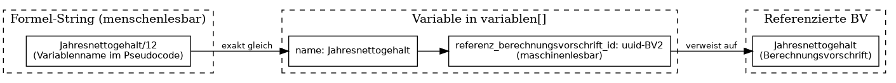
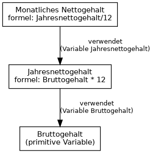

# Definition: Berechnungsvorschriften

## Was ist eine Berechnungsvorschrift?

Eine **Berechnungsvorschrift** ist ein strukturiertes Objekt, das die Berechnung eines Wertes beschreibt. Sie besteht aus:

| Bestandteil | Beschreibung |
|-------------|--------------|
| **Name** | Bezeichnung der Berechnungsvorschrift (z.B. „monatliches Nettogehalt“) |
| **Formel** | Menschenlesbarer Pseudocode (keine Excel-Syntax) |
| **Variablen** | Liste der Wertquellen, die in die Formel einfließen |
| **Metadaten** | Kategorie, Symbol, Datentyp, Einheit |
| **Quelle** | Optionale Referenz zur ursprünglichen Excel-Zelle (für Matching) |
| **Version** | Versionsnummer (wird bei Änderung erhöht) |

## Variablen

Jede Wertquelle in der Formel wird als **Variable** abgebildet:

- **Primitive Variable** (`ist_primitive = true`): Einfacher Eingabewert (z.B. Zelle, Spalte). Keine Referenz auf eine andere Berechnungsvorschrift.
- **Verlinkte Variable** (`ist_primitive = false`): Verweist auf eine andere Berechnungsvorschrift. Der Wert wird aus der referenzierten Berechnungsvorschrift ermittelt.

Der Variablenname muss exakt mit dem Namen im Formel-String übereinstimmen (Verlinkbarkeit, Auswertung).

### Referenz auf andere Berechnungsvorschriften

Eine Variable verweist auf eine andere Berechnungsvorschrift über:

| Mechanismus | Beschreibung |
|-------------|--------------|
| **Im Formel-String** | Der Variablenname erscheint im Pseudocode (z.B. `Jahresnettogehalt/12`). Er ist menschenlesbar und dient der Anzeige. |
| **In der Variablen-Definition** | Das Feld `referenz_berechnungsvorschrift_id` enthält die eindeutige ID (UUID) der referenzierten Berechnungsvorschrift. Dies ist die maschinenlesbare Referenz. |
| **Matching** | Beim Erzeugen wird automatisch geprüft: Gibt es eine BV mit passender Quelle (Zellenidentifikator, Tabellenblatt) oder Beschreibung? Bei genau einem Treffer wird `referenz_berechnungsvorschrift_id` gesetzt und `ist_primitive = false`. |

**Zwei-Ebenen-Modell:**
- **Anzeige:** Variablenname im Formel-String (für Menschen)
- **Referenz:** `referenz_berechnungsvorschrift_id` in der Variablen-Liste (für Maschinen, Navigation, Auswertung)

Bei primitiven Variablen ist `referenz_berechnungsvorschrift_id` leer; der Wert kommt aus einer externen Quelle (z.B. Excel-Zelle).

## Abhängigkeiten

Für jede Berechnungsvorschrift werden zwei Listen geführt:

- **„Verwendet folgende Berechnungsvorschriften“**: Alle BVs, die im Pseudocode dieser Berechnungsvorschrift vorkommen (anklickbar zur Navigation).
- **„Wird verwendet in“**: Alle BVs, die diese Berechnungsvorschrift referenzieren.

## Formel-Syntax (Pseudocode)

Die Formel wird als **Pseudocode** dargestellt – sowohl **menschenlesbar** als auch **maschinenlesbar** für die Auswertung.

### Grundprinzipien

| Anforderung | Beschreibung |
|-------------|--------------|
| **Menschenlesbar** | Sprechende Variablennamen, keine Excel-Syntax, keine Kommentare |
| **Maschinenlesbar** | Eindeutige Zuordnung: Jeder Variablenname im Formel-String muss exakt einer Variable in `variablen[]` entsprechen |
| **Deterministisch** | Keine Ambiguität – Variablenname und Operatoren sind eindeutig interpretierbar |

### Erlaubte Elemente

- **Variablen:** Namen aus `variablen[].name` (exakt, case-sensitive)
- **Operatoren:** `+`, `-`, `*`, `/`, `(` `)` für arithmetische Ausdrücke
- **Bedingungen:** `Wenn Bedingung dann Wert1 sonst Wert2` (für WENN-Funktionen)
- **Vergleiche:** `>`, `<`, `>=`, `<=`, `=`, `<>` (in Bedingungen)

### Nicht erlaubt

- Kein `=`, keine Zellreferenzen (A1, $B$2), keine Bereichsnotation (A1:A10)
- Keine Kommentare im Pseudocode
- Keine Excel-Funktionsnamen (SUMME, MITTELWERT etc.) – werden in lesbare Form umgewandelt

### Beispiele

| Excel | Pseudocode |
|-------|------------|
| `=B1/12` | `Jahresnettogehalt/12` |
| `=A1+B1*C1` | `Bruttogehalt + Zulage * Faktor` |
| `=WENN(C1>0;D1;0)` | `Wenn Bedingung dann Wert1 sonst 0` |
| `=SUMME(A1:A10)` | `Wert1 + Wert2 + … + Wert10` (mit sprechenden Variablennamen) |

## Abhängigkeitsgraph

Die Abhängigkeiten zwischen Berechnungsvorschriften lassen sich als Graph darstellen:

*Für die vollständige Darstellung: `./diagramme/render.sh` ausführen (Graphviz erforderlich).*
