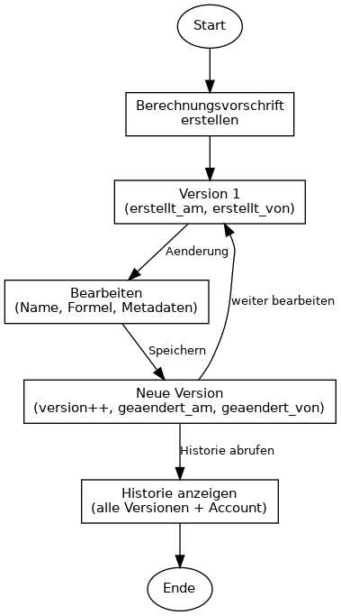

# Versionierungskonzept

## Übersicht

Die Versionierung von Berechnungsvorschriften ermöglicht Nachvollziehbarkeit und Rückverfolgbarkeit von Änderungen. Die folgenden Optionen beschreiben **unterschiedliche fachliche Strategien** – jede schließt die andere aus. Ohne technische Umsetzungsdetails.

## Account-Referenz bei Änderungen

Unabhängig von der gewählten Versionierungsstrategie sollte jede Version einen Verweis auf den **Account** (Benutzer) enthalten, der die Änderung herbeigeführt hat:

| Feld | Bedeutung |
|------|-----------|
| `erstellt_von` | Account, der die Berechnungsvorschrift angelegt hat |
| `geaendert_von` | Account, der die letzte Änderung (diese Version) vorgenommen hat |

Damit ist jeder Versionsstand einer Person zuordenbar – für Audit, Nachverfolgung und Rückfragen.

## Versionierungsoptionen (unterschiedliche Strategien)

### Option A: Minimal – nur aktuelle Version

- **Prinzip:** Es wird nur die aktuelle Version gespeichert. Bei jeder Änderung wird die alte Version überschrieben. Die Versionsnummer wird erhöht – aber die alte Version ist nicht mehr abrufbar.
- **Vorteil:** Einfach, geringer Speicherbedarf, keine Historie-Verwaltung.
- **Nachteil:** Keine Wiederherstellung, keine Nachvollziehbarkeit vergangener Zustände.
- **Einsatz:** Wenn nur die aktuelle Version relevant ist und keine Compliance-Anforderungen bestehen.

### Option B: Vollständige Historie mit allen Versionen

- **Prinzip:** Jede Änderung erzeugt eine neue Version. Alle Versionen bleiben erhalten und sind abrufbar. Jede Version ist unveränderlich (immutable).
- **Vorteil:** Vollständige Nachvollziehbarkeit, Wiederherstellung alter Versionen möglich, Audit-Trail.
- **Nachteil:** Höherer Speicherbedarf, Historie muss gepflegt und abgefragt werden können.
- **Einsatz:** Wenn Nachvollziehbarkeit, Compliance oder Audit-Anforderungen relevant sind.

### Option C: Branch-basierte Versionierung

- **Prinzip:** Es gibt eine Hauptversion („Produktion“) und optional Entwurfsversionen („Branches“). Änderungen erfolgen zunächst in einem Branch; nach Freigabe wird in die Hauptversion übernommen.
- **Vorteil:** Klare Trennung zwischen Entwurf und freigegebener Version, kontrollierte Freigabe.
- **Nachteil:** Komplexer, erfordert Freigabe-Workflow.
- **Einsatz:** Wenn formale Freigabeprozesse erforderlich sind (z.B. Prüfung vor Aktivierung).

### Option D: Stichtag-basierte Snapshots

- **Prinzip:** Zu bestimmten Stichtagen (z.B. Jahresabschluss, Quartalsende) werden Snapshots aller Berechnungsvorschriften erstellt. Die laufende Version kann sich ändern; die Stichtags-Versionen bleiben fix.
- **Vorteil:** Reproduzierbarkeit zu Stichtagen, z.B. für Berichte oder Audits.
- **Nachteil:** Keine Versionierung pro Änderung, nur zu definierten Zeitpunkten.
- **Einsatz:** Wenn Stichtags-Konsistenz erforderlich ist (z.B. Rechnungslegung).

## Empfehlung

**Empfohlen wird Option B: Vollständige Historie mit allen Versionen.**

Begründung: Berechnungsvorschriften sind oft fachlich und rechtlich relevant. Nachvollziehbarkeit, Wiederherstellung bei Fehlern und Audit-Trail sind in der Regel wichtiger als Speicherersparnis. Die Account-Referenz (`geaendert_von`) ergänzt die Option sinnvoll.

## Was wird versioniert?

Die **gesamte Berechnungsvorschrift** wird versioniert – inklusive:

- Name, Formel, Variablen
- Metadaten (Kategorie, Symbol, Datentyp, Einheit)
- Quelle-Information
- Verlinkungen zu anderen Berechnungsvorschriften
- `erstellt_von` / `geaendert_von` (Account-Referenz)

## Lebenszyklus

Der typische Lebenszyklus einer Berechnungsvorschrift:

*Für die vollständige Darstellung: `./diagramme/render.sh` ausführen (Graphviz erforderlich).*
