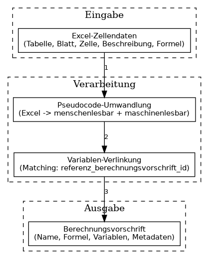
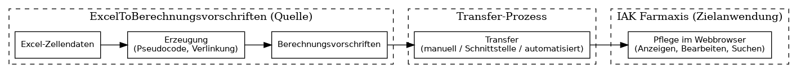

# Wartung von Berechnungsvorschriften

## Übersicht

Die Wartung von Berechnungsvorschriften erfolgt im Webbrowser in der Anwendung **IAK Farmaxis**. Die **Erzeugung** erfolgt primär in **ExcelToBerechnungsvorschriften**; die Daten werden in einem Prozess zu IAK Farmaxis übertragen.

## Erzeugung und Datenfluss

### Primär: ExcelToBerechnungsvorschriften

Die **Erzeugung** von Berechnungsvorschriften erfolgt primär im Projekt **ExcelToBerechnungsvorschriften**:

1. **Eingabe:** Tabellenidentifikator, Tabellenblatt, Zellenidentifikator, Beschreibung, Formel (Excel-Zellendaten)
2. **Verarbeitung:** Pseudocode-Umwandlung (Excel-Syntax → menschenlesbar), Variablen-Verlinkung
3. **Ausgabe:** Strukturierte Berechnungsvorschrift mit Name, Formel, Variablen, Metadaten

### Transfer zu IAK Farmaxis

Die erzeugten Berechnungsvorschriften werden in einem **Prozess** zu IAK Farmaxis übertragen:

- ExcelToBerechnungsvorschriften ist die **Quelle** der Daten
- IAK Farmaxis ist die **Zielanwendung** für Pflege und Anzeige
- Der Transfer kann manuell (Export/Import), per Schnittstelle oder automatisiert erfolgen
- Nach dem Transfer stehen die Daten in IAK Farmaxis für die weitere Pflege zur Verfügung

### Pflege im Webbrowser (IAK Farmaxis)

In IAK Farmaxis können Berechnungsvorschriften:

- **angezeigt** werden (Details, Abhängigkeiten)
- **bearbeitet** werden (Formel, Metadaten)
- **gesucht** werden (über Metadaten: Name, Kategorie, Symbol, Datentyp, Einheit)

Änderungen in IAK Farmaxis können – je nach Prozess – zurück zu ExcelToBerechnungsvorschriften fließen oder dort separat geführt werden.

## Workflows

| Workflow | Beschreibung |
|----------|--------------|
| **Neuanlage** | Excel-Zellendaten in ExcelToBerechnungsvorschriften eingeben → Berechnungsvorschrift wird erzeugt → Transfer zu IAK Farmaxis |
| **Bearbeitung** | BV in IAK Farmaxis öffnen → Änderungen vornehmen → Speichern (erzeugt neue Version) |
| **Historie anzeigen** | Versionsverlauf einer BV einsehen |
| **Variablen-Verlinkung ändern** | Verlinkung aufheben (Variable wird primitiv) oder manuell verlinken (bei mehreren Treffern) |

## Benutzeraktionen

*Für die vollständige Darstellung: `./diagramme/render.sh` ausführen (Graphviz erforderlich).*

## Rollen (konzeptionell)

Die Frage „Wer darf was?“ sollte organisationsspezifisch geklärt werden:

- Wer darf neue Berechnungsvorschriften in ExcelToBerechnungsvorschriften anlegen?
- Wer darf den Transfer zu IAK Farmaxis auslösen?
- Wer darf bestehende BVs in IAK Farmaxis bearbeiten?
- Wer darf Verlinkungen ändern?
- Wer darf die Historie einsehen?

Diese Rollen sind fachlich zu definieren und in den Anwendungen abzubilden.
