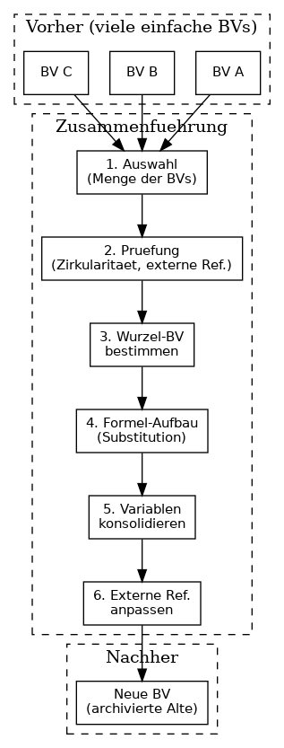

# Zusammenführung von Berechnungsvorschriften

## Ausgangslage

**ExcelToBerechnungsvorschriften** bildet jede Zelle aus einem Excel-Dokument zu **einer** Berechnungsvorschrift ab. Das führt zu:

- **Vielen einfachen Berechnungsvorschriften** – oft nur eine Zelle oder eine einfache Formel pro BV
- **Starker Verlinkung** – BVs referenzieren sich gegenseitig über Variablen
- **Schwer überschaubarer Struktur** – bei großen Excel-Dateien entstehen hunderte BVs

**Beispiel:** Eine Excel-Tabelle mit 200 Zellen ergibt 200 Berechnungsvorschriften, die stark miteinander verlinkt sind.

## Ziel der Zusammenführung

Als Anwender soll es möglich sein, eine **Menge an Berechnungsvorschriften zusammenzuführen** – also mehrere BVs zu einer oder wenigen BVs zu konsolidieren. Dadurch:

- Weniger, aber inhaltlich reichhaltigere BVs
- Bessere Übersicht für die Pflege
- Fachlich sinnvollere Gruppierung (z.B. alle Berechnungen zu „Lohnkosten“ in einer BV)

## Konzept

### Grundidee

Mehrere Berechnungsvorschriften werden zu **einer** Berechnungsvorschrift zusammengeführt. Die resultierende BV enthält:

- Einen **konsolidierten Namen** (z.B. aus der übergeordneten Kategorie)
- Eine **kombinierte Formel** – entweder als Verkettung der Einzelformeln oder als neue Gesamtformel
- **Alle Variablen** der Ursprungs-BVs (ohne Duplikate)
- **Metadaten** aus der „Haupt-BV“ oder neu definiert

### Voraussetzungen für die Zusammenführung

| Voraussetzung                                  | Beschreibung                                                                                                                           |
| ---------------------------------------------- | -------------------------------------------------------------------------------------------------------------------------------------- |
| **Keine zirkulären Abhängigkeiten**            | Die zu zusammenführenden BVs dürfen untereinander keine Zirkularität aufweisen (A→B→C→A)                                               |
| **Konsistente Metadaten**                      | Kategorie, Datentyp, Einheit sollten kompatibel sein – sonst Warnung                                                                   |
| **Keine externen Referenzen auf „innere“ BVs** | BVs außerhalb der Menge dürfen nicht auf BVs verweisen, die nur intern verwendet werden (oder die Referenzen müssen umgeleitet werden) |

### Ablauf (konzeptionell)

1. **Auswahl:** Anwender wählt die Menge der zu zusammenführenden BVs (z.B. alle BVs eines Tabellenblatts, einer Kategorie, oder manuell)
2. **Prüfung:** System prüft Zirkularität, externe Referenzen, Metadaten-Konsistenz
3. **Bestimmung der „Wurzel-BV“:** Die BV, die von keiner anderen in der Menge referenziert wird (oder die fachlich als Haupt-BV gilt), wird zur Basis
4. **Formel-Aufbau:** Die Formeln werden zu einer Gesamtformel zusammengeführt – entweder durch Substitution (Variablen durch Unterformeln ersetzen) oder durch explizite Verkettung
5. **Variablen-Konsolidierung:** Alle Variablen werden gesammelt; Variablen, die auf zusammengeführte BVs verweisen, werden zu primitiven Variablen oder auf die neue BV umgeleitet
6. **Referenz-Anpassung:** Alle BVs außerhalb der Menge, die auf die alten BVs verwiesen haben, werden auf die neue BV umgestellt (oder auf die entsprechende Variable in der neuen BV)
7. **Löschung/Archivierung:** Die alten BVs werden gelöscht oder archiviert

## Potenzielle Probleme

### 1. Zirkuläre Abhängigkeiten

**Problem:** BV A verwendet BV B, BV B verwendet BV C, BV C verwendet BV A. Eine Zusammenführung ist nicht eindeutig möglich.

**Lösung:** Zusammenführung nur zulassen, wenn die Menge azyklisch ist. Bei Zyklen: Fehlermeldung, Anwender muss die Menge anpassen.

### 2. Externe Referenzen

**Problem:** BV X (außerhalb der Menge) verweist auf BV B (in der Menge). Nach der Zusammenführung existiert BV B nicht mehr.

**Lösung:** Vor der Zusammenführung prüfen, welche externen BVs auf die zu zusammenführenden BVs verweisen. Optionen:

- **Umleitung:** Die Referenz in X wird auf die neue BV umgestellt (wenn die Variable in der neuen BV erhalten bleibt)
- **Ablehnung:** Zusammenführung verweigern, bis der Anwender die externen Referenzen manuell löst
- **Kaskadierte Anpassung:** Externe BVs werden automatisch angepasst (kann unerwünschte Nebenwirkungen haben)

### 3. Verlust von Granularität

**Problem:** Nach der Zusammenführung ist die feine Struktur (eine Zelle = eine BV) verloren. Einzelne Fehler sind schwerer zu lokalisieren.

**Lösung:** Die ursprünglichen BVs können **archiviert** statt gelöscht werden. Oder: Die neue BV enthält `quelle`-Informationen, die auf die ursprünglichen Zellen verweisen (z.B. als Liste von Quellen).

### 4. Formel-Komplexität

**Problem:** Die zusammengeführte Formel kann sehr lang und unübersichtlich werden – besonders wenn viele BVs mit komplexen Formeln zusammengeführt werden.

**Lösung:** 

- Zusammenführung auf **fachlich sinnvolle** Mengen beschränken (z.B. max. 5–10 BVs)
- Option: Statt einer Monolith-Formel eine **strukturierte Darstellung** (z.B. Unterformeln als benannte Blöcke)
- Klare Namensgebung für Variablen in der resultierenden BV

### 5. Metadaten-Konflikt

**Problem:** Die zu zusammenführenden BVs haben unterschiedliche Kategorien, Einheiten oder Datentypen.

**Lösung:** **Benutzerentscheidung bei Konflikten** – der Anwender muss die Metadaten der neuen BV explizit festlegen. Das System warnt bei Inkonsistenzen und schlägt einen Default vor (z.B. aus der „Haupt-BV“). Siehe [07 Konzeptioneller Rahmen](07_konzeptioneller_rahmen.md).

### 6. Reihenfolge und Auswertung

**Problem:** Bei der Zusammenführung muss die Auswertungsreihenfolge stimmen – Variablen müssen vor ihrer Verwendung definiert sein.

**Lösung:** Die Zusammenführung erfolgt entlang des Abhängigkeitsgraphen mittels [topologischer Sortierung](https://en.wikipedia.org/wiki/Topological_sorting) – dem Standardverfahren für DAGs, um eine lineare Reihenfolge zu ermitteln. Die resultierende Formel wird so aufgebaut, dass die Reihenfolge korrekt ist. Siehe [07 Konzeptioneller Rahmen](07_konzeptioneller_rahmen.md).

## Empfehlung

- **Zusammenführung als explizite Benutzeraktion** – nicht automatisch. Der Anwender wählt die Menge und bestätigt die Zusammenführung.
- **Vorschau vor Ausführung** – das System zeigt die resultierende BV (Name, Formel, Variablen) zur Prüfung an, bevor die Zusammenführung durchgeführt wird.
- **Archivierung statt Löschung** – die ursprünglichen BVs werden archiviert (z.B. mit Flag „zusammengeführt_in“), sodass bei Bedarf nachvollzogen werden kann, woher die neue BV stammt.

