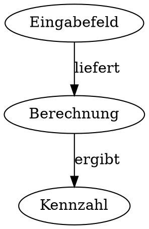
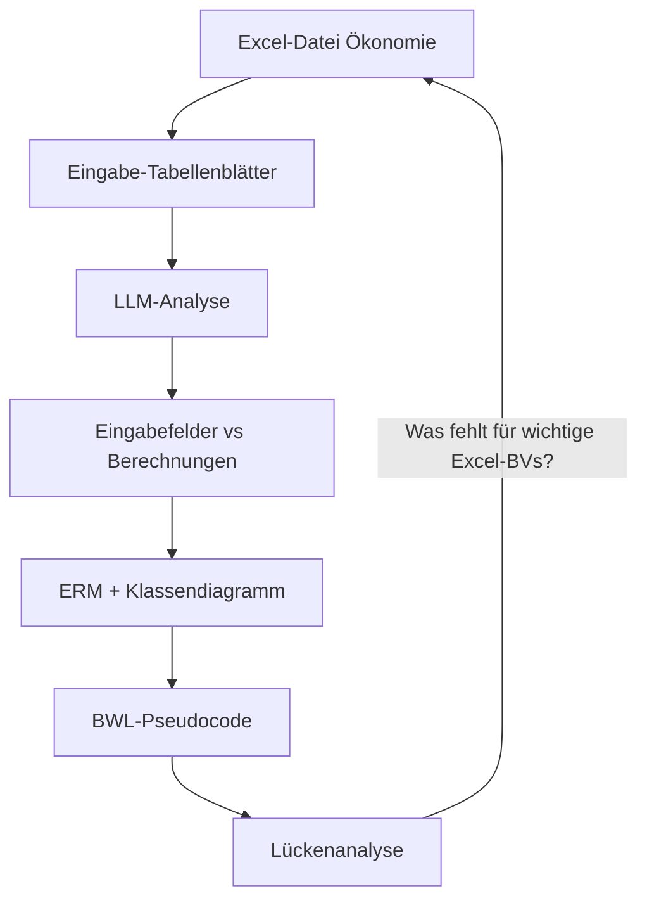

# LLM-gestützte Modell-Analyse als alternativer Ansatz

## Einleitung und Abgrenzung

[08 Warum nicht alle Formeln](08_warum_nicht_alle_formeln.md) argumentiert für eine **selektive Überführung**: Nur fachlich zentrale Berechnungen als Berechnungsvorschriften (BVs) überführen. Der Ansatz ist **bottom-up** – ausgehend von Excel-Zellen werden BVs erzeugt und manuell priorisiert (z.B. über `wichtige_zellen` in der Config).

Dieses Kapitel stellt einen **alternativen Ansatz** vor: **LLM-gestützte Modell-Analyse**. Statt zellweise zu importieren, analysiert ein Large Language Model (LLM) die Struktur ganzer Tabellenblätter und leitet daraus ein fachliches Datenmodell sowie grundlegende BWL-Berechnungen ab. Ziel ist eine **top-down**-Perspektive: Erst das Modell verstehen, dann Lücken identifizieren.

**Zielgruppe:** Fachverantwortliche und Entwickler, die die Excel-Überführung planen oder alternative Wege zur Modellierung evaluieren.

---

## Kernidee

| Aspekt | Beschreibung |
| ------ | ------------ |
| **Ausgangspunkt** | Excel-Datei zur Ökonomie (oder andere Domäne) |
| **LLM-Eingabe** | Tabellenblätter der Eingabe (nicht einzelne Zellen) |
| **LLM-Aufgabe** | Unterscheiden: Eingabefelder vs. Berechnungen |
| **Zweck** | Passendes Datenmodell für die Anwendung |

Die Idee: Die **Eingabe-Tabellenblätter** der Excel-Datei werden an das LLM gesendet. Das LLM klassifiziert, welche Zellen/Bereiche **Eingabefelder** (Stammdaten, manuelle Eingabe) und welche **Berechnungen** (Formeln, abgeleitete Werte) sind. Aus dieser Analyse und der Excel-Struktur werden ein **Entity-Relationship-Modell (ERM)**, ein **Klassendiagramm** und **grundlegende BWL-Berechnungen als Pseudocode** erzeugt. Damit lässt sich prüfen, was noch fehlt, damit die wichtigen Berechnungsvorschriften der Excel berechnet werden können.

---

## Ablauf (detailliert)

1. **Tabellenblätter an LLM senden**: Die Eingabe-Blätter der Excel-Datei werden als strukturierte Daten (z.B. Bereichsübersicht, Spaltenköpfe, Zelltypen) an das LLM übergeben.

2. **LLM-Klassifikation**: Das LLM identifiziert pro Zelle/Bereich: Eingabefeld (Stammdaten, manuelle Eingabe) oder Berechnung (Formel, abgeleiteter Wert).

3. **Modellierung aus Excel + LLM-Output**: Die Excel-Struktur wird mit der LLM-Analyse kombiniert – z.B. welche Entitäten es gibt, welche Beziehungen zwischen ihnen bestehen.

4. **BWL-Pseudocode generieren**: Das LLM erstellt grundlegende BWL-Berechnungen als Pseudocode (nicht zellweise, sondern fachlich zusammengefasst). Siehe [01 Definition](01_definition.md) für die Pseudocode-Syntax.

5. **Ergebnisse** (siehe Abschnitt [Ergebnisformate](#ergebnisformate)):
   - ERM und Klassendiagramm: Beziehungen als **DOT (Graphviz)**, Eigenschaften als **Markdown-Tabellen**
   - Grundlegende Berechnungsformeln (Pseudocode)

6. **Lückenanalyse**: Die generierten Modelle (ERM, Klassendiagramm) und Berechnungsvorschriften werden mit den wichtigen Berechnungsvorschriften der Excel verglichen. Dabei wird festgestellt, **was noch fehlt**, damit die wichtigen Berechnungsvorschriften der Excel berechnet werden können.

---

## Ergebnisformate

Die Ausgabe des LLM bzw. der Modellierungs-Pipeline soll in zwei konkreten Formaten erfolgen:

### Beziehungen: DOT (Graphviz)

Die **Beziehungen zwischen Konzepten und Klassen** werden als DOT-Dateien (Graphviz) erstellt. DOT ist eine textuelle Beschreibungssprache für Graphen und ermöglicht die Darstellung von Entitäten und ihren Beziehungen – z.B. ERM-Diagramme oder Klassendiagramme. Die Dateien können mit Graphviz gerendert werden (siehe [diagramme/README.md](diagramme/README.md)).

**Beispiel (vereinfacht):**

### Eigenschaften: Markdown-Tabellen

Die **Eigenschaften von Klassen und Modellen** werden als **Tabellen in Markdown** erfasst. So bleiben Attribute, Datentypen und Zuordnungen versionierbar und lesbar.

**Beispiel Klasse:**

| Eigenschaft | Typ | Beschreibung |
| ---------- | --- | ------------ |
| `Arbeitsstunden` | decimal | Jahresarbeitszeit in Stunden |
| `Stundensatz` | decimal | Lohn pro Stunde in EUR |
| `Jahreslohn` | decimal | Berechnet: Arbeitsstunden × Stundensatz |

**Beispiel Entität (ERM):**

| Attribut | Kardinalität | Referenz |
| -------- | ------------ | -------- |
| `Mitarbeiter` | 1 | – |
| `Arbeitsvertrag` | n | Mitarbeiter |

---

## Ablauf-Diagramm

---

## Erörterung: Vor- und Nachteile

### Vorteile

| Aspekt | Beschreibung |
| ------ | ------------ |
| **Fachliche Ableitung** | Das Datenmodell wird aus fachlicher Sicht abgeleitet, nicht aus Zellreferenzen. |
| **Zwischenergebnisse** | ERM und Klassendiagramm sind nützlich für IAK Farmaxis und die Anwendungsarchitektur. |
| **Lückenanalyse** | Systematisch prüfen, was in den generierten Modellen und BVs noch fehlt, damit die wichtigen Excel-Berechnungen ausgeführt werden können. |
| **Weniger manuelle Config** | Geringere Abhängigkeit von `wichtige_zellen` – das LLM unterstützt die Priorisierung. |

### Nachteile und Risiken

| Aspekt | Beschreibung |
| ------ | ------------ |
| **LLM-Halluzinationen** | Falsche Zuordnung von Eingabe vs. Berechnung möglich. |
| **Token-Limit** | Große Excel-Dateien müssen in Chunks aufgeteilt werden. |
| **Matching** | Keine 1:1-Zuordnung zu Zellen – Matching mit bestehenden BVs schwieriger. |
| **Zusätzlicher Aufwand** | Neuer LLM-Prompt, neues Datenformat für Blatt-Übergabe erforderlich. |

---

## Verhältnis zum bestehenden Ansatz

Der LLM-Modell-Analyse-Ansatz ist **kein Ersatz**, sondern eine **Ergänzung** zum selektiven Überführungsansatz aus [08 Warum nicht alle Formeln](08_warum_nicht_alle_formeln.md):

- Der Ansatz kann **vor** der selektiven Überführung laufen – das Modell dient als Referenz für „was ist fachlich zentral“.
- **Hybrid**: LLM-Modell-Analyse für Strukturverständnis; Zell-für-Zell-Import (ggf. mit DSL) für die eigentliche BV-Generierung.

---

## Technische Anknüpfungspunkte

| Komponente | Beschreibung |
| ---------- | ------------ |
| [LLMService](../backend/services/llm_service.py) | Aktuell: Zelleneingabe → BV. Ein neuer Endpoint oder Prompt für Blatt-Analyse ist denkbar. |
| [excel_import.py](../backend/scripts/excel_import.py) | Könnte Tabellenblätter als strukturierte Eingabe für das LLM vorbereiten. |
| [EXCEL_IMPORT_PLAN.md](../EXCEL_IMPORT_PLAN.md) | Architektur-Erweiterung für den Import-Prozess. |

---

## Verweise

| Kapitel | Inhalt |
| ------- | ------ |
| [08 Warum nicht alle Formeln](08_warum_nicht_alle_formeln.md) | Begründung für selektive Überführung (Gegenstück zu diesem Ansatz) |
| [01 Definition](01_definition.md) | Pseudocode-Syntax, Variablen, Berechnungsvorschriften-Struktur |
| [07 Konzeptioneller Rahmen](07_konzeptioneller_rahmen.md) | DAG, DSL, MDM – etablierte Konzepte |
